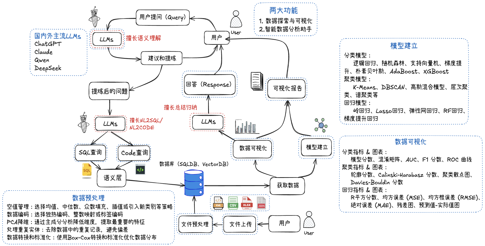

# InsightFlow Analyst 🪄

**InsightFlow Analyst** 是一个由大语言模型驱动的先进应用程序，它简化了整个数据分析流程，集成了两大核心功能：数据探索与可视化和智能数据分析助手。它自动化了从数据预处理到模型测试的所有任务，以精确的方式简化复杂的数据分析任务。告别繁琐的数据任务，让 **InsightFlow Analyst** 施展魔法吧！✨

### 🔄 系统主要流程与功能图




### InsightFlow Analyst 能做什么？

### 📊 数据探索与可视化

- 自动生成专业图表
- 交互式数据探索
- 多维度数据展示

### 💬 智能数据分析助手

- 自然语言交互，轻松提问
- 自动数据洞察与解释
- 智能建议与预测分析

以及更多的智能功能...


### 如何使用 InsightFlow Analyst？

1. **上传数据文件**：将您的数据文件上传到平台。
2. **选择分析模式**：选择适合的分析模式，系统会根据您的需求自动决策并执行任务。
3. **开始分析**：点击开始按钮，InsightFlow Analyst 将开始处理您的数据并返回分析结果。

所有处理后的数据、图表和训练好的模型都可以方便地下载，便于后续使用或分享。

---

## 安装与使用

### 克隆项目
首先，克隆该项目到本地：
```bash
git clone https://github.com/VanceF-21/InsightFlow-Analyst.git
```

### 安装依赖
进入项目目录并安装所有依赖：
```bash
cd InsightFlow-Analyst
pip install -r requirements.txt
```

### 启动应用
```bash
streamlit run /your_path_to_the_project/app/app.py
```

---

## 示例数据
在 sample_data 文件夹中，您可以找到用于测试的示例数据集，可以直接上传这些示例数据进行分析。